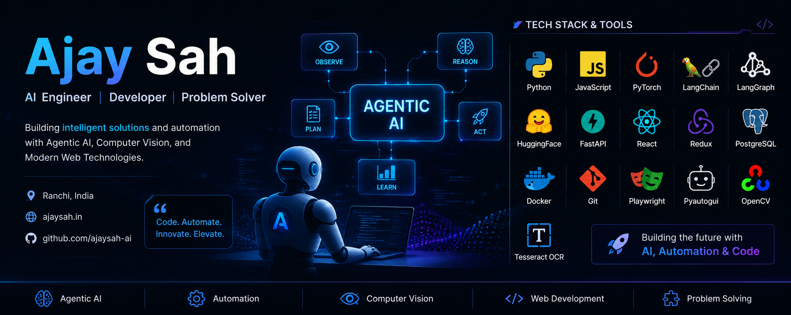

<!-- 🖼️ BANNER — put your banner image filename here (e.g. banner.png) -->

<!-- Typing animation header -->

<!-- Social badges -->

  
  
  

---

### 🧠 About Me

- 🎓 BCA student from **Jamshedpur, Jharkhand, India**
- 🤖 Focused on **Agentic AI Systems**, **LLM Engineering**, and **Full-Stack Development**
- 🔭 Currently building an **AI-first CRM module** (React + FastAPI + LangGraph + Groq LLMs)
- ⚙️ Also building a **Python Automation Agent** for Institute Management Systems
- 📚 Progressing through a structured **NLP/LLM mastery curriculum** (RNNs → LSTMs → Attention → Transformers)
- 🛠️ Built a **transformer from scratch** (~9.74M params) with RMSNorm, RoPE, GQA, SwiGLU
- 💡 Entrepreneurially minded — love turning real-world problems into AI-powered MVPs

---

### 🚀 Featured Projects

<table>
<tr>
<td width="50%">

**🔧 GitHub Automation Agent**
Production-grade multi-graph LangGraph system with a custom MCP server, Hybrid RAG (BM25 + TF-IDF), JWT auth, Fernet encryption, and crash-recovery. Deployed on HF Spaces + Vercel.

</td>
<td width="50%">

**📊 AI-Powered CRM (HCP Log Interaction)**
Full-stack CRM module using React + Redux Toolkit, FastAPI, LangGraph + Groq LLMs, PostgreSQL, Docker Compose — with a two-step approval-gated agent flow.

</td>
</tr>
</table>

---

### 🛠️ Tech Stack

**Languages**

**AI / Agentic**

**Backend / Frontend**

**Database / DevOps**

**Automation (Desktop & Web)**

---

### 📊 GitHub Stats

  
  

  

  

---

### 📈 Contribution Snake

  

---

**💬 Ask me about:** Agentic AI · LangGraph · RAG Pipelines · LLM Fine-tuning · Full-Stack AI Products

