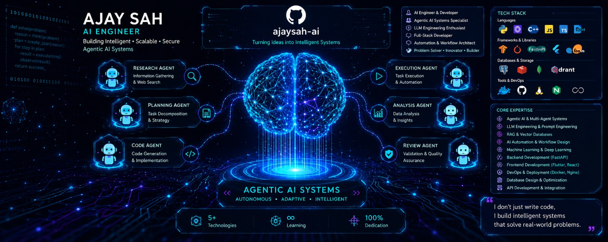

<!-- 🖼️ BANNER — put your banner image filename here (e.g. banner.png) -->

<!-- Typing animation header -->

<!-- Social badges -->

  
  
  
  
  

---

### 🧠 About Me

> *"I help startups ship AI features 10x faster — building production-grade multi-agent systems, RAG pipelines, and automation that delivers real business value."*

- 🎓 **BCA Student** from **Jamshedpur, Jharkhand, India** (IGNOU)
- 🤖 **AI Engineer** specializing in **Agentic AI Systems**, **LLM Engineering**, and **Full-Stack Development**
- 🏗️ **Multi-agent architect** — designing production-grade AI systems with LangGraph, RAG pipelines, and autonomous workflows
- 🔭 Currently building:
  - **Product Intelligence AI** — Multi-agent system transforming minimal product data into validated 252-column enterprise PIM catalog records
  - **GitHub Automation Agent** — Orchestrated 1000+ GitHub operations without human intervention
  - **AI-first CRM module** (React + FastAPI + LangGraph + Groq LLMs)
- 📚 **Mastering the AI stack**: RNNs → LSTMs → Attention → Transformers → Agentic AI
- 🛠️ **Built a transformer from scratch** (~9.74M params) with RMSNorm, RoPE, GQA, SwiGLU
- 💡 **Entrepreneurially minded** — turning real-world problems into scalable AI-powered MVPs
- 🎯 **Open to opportunities**: Internships, freelance projects, and full-time AI engineering roles
- 📅 **Availability**: Currently accepting 2 clients for September 2026

---

### 🏆 Certifications

  
  

  <i>Received July 2026</i> — Latest Agentic AI patterns, best practices, and enterprise deployment strategies

---

### 🚀 Featured Projects

<table>
<tr>
<td width="33.33%">

**🏭 Product Intelligence AI**
Multi-agent system transforming minimal product data (MPN, short description) into validated 252-column enterprise PIM catalog records. Features four specialized retrieval agents: Website, Catalog, Tech Doc, and Digital Asset. Uses hybrid RAG with BM25 + vector search, confidence scoring, and source provenance.

**Tech Stack:** LangGraph, LangChain-Groq, FastAPI, PostgreSQL + pgvector, MCP Server, React + Vite, Docker

</td>
<td width="33.33%">

**🤖 GitHub Automation Agent**
Production-grade multi-graph LangGraph system orchestrating 1000+ GitHub operations without human intervention. Reduced dev ops work by 60%. Features custom MCP server, Hybrid RAG (BM25 + TF-IDF), JWT auth, Fernet encryption, and crash-recovery. Deployed on HF Spaces + Vercel.

**Tech Stack:** LangGraph, MCP Server, Hybrid RAG, JWT, Fernet, Vercel

</td>
<td width="33.33%">

**📊 AI-Powered CRM (HCP Log Interaction)**
Full-stack CRM module with 2-stage AI approval workflow for regulated industries. HIPAA-compliant with mandatory human oversight. Built with React + Redux Toolkit, FastAPI, LangGraph + Groq LLMs, PostgreSQL, Docker Compose.

**Tech Stack:** React, Redux Toolkit, FastAPI, LangGraph, Groq LLMs, PostgreSQL, Docker

</td>
</tr>
</table>

---

### 🛠️ Tech Stack

**Languages**

**AI / Agentic**

**Backend / Frontend**

**Database & Caching**

**DevOps & Infrastructure**

**Automation (Desktop & Web)**

---

### 💻 Key Competencies

| Domain | Skills |
|--------|--------|
| **Agentic AI** | Multi-agent orchestration, Graph-based workflows (LangGraph), MCP (Model Context Protocol), Tool use & function calling, Autonomous agents with crash recovery, Human-in-the-loop workflows |
| **LLM Engineering** | Fine-tuning, Prompt engineering, RAG pipelines (Hybrid BM25 + Vector), Token optimization, LLM deployment & inference, Groq LLMs |
| **Backend Architecture** | FastAPI, async programming, RESTful APIs, SQLAlchemy ORM, PostgreSQL + pgvector, Redis caching, JWT authentication |
| **Full-Stack Development** | React + Redux + Vite, state management, form handling, responsive UI, FastAPI + PostgreSQL integration, Docker Compose |
| **AI/ML** | PyTorch, transformers, RNNs/LSTMs, attention mechanisms, model training, computer vision (OpenCV), OCR (Tesseract) |
| **DevOps & Deployment** | Docker containerization, Kubernetes orchestration, CI/CD pipelines, Vercel deployment, Hugging Face Spaces |
| **Automation** | Web automation (Playwright), desktop automation (PyAutoGUI), OCR (Tesseract), image processing |

---

### 📊 GitHub Stats

  
  

  

---

### 📈 Contribution Snake

  

---

### 📬 Let's Connect

**💬 Ask me about:** Agentic AI · LangGraph · Multi-agent Systems · RAG Pipelines · LLM Engineering · FastAPI · React · Full-Stack AI Products

**🤝 Let's collaborate on:** AI automation projects, LLM applications, open-source AI tools, and production-grade agentic systems

---

### 📞 Contact Me

  
  
  
  

**📧 Email:** ajay.sah.aieng@gmail.com  
**📱 Phone:** +91 8969594358  
**🌐 Portfolio:** https://ajaysah-ai.github.io

---

<i>Currently accepting 2 clients for September 2026 — Free 15-minute discovery call available!</i>

